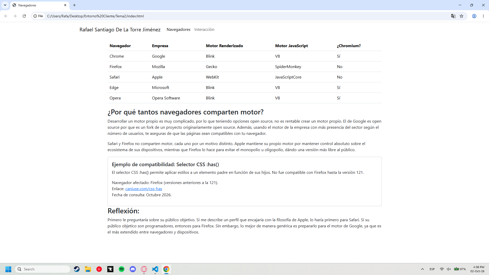
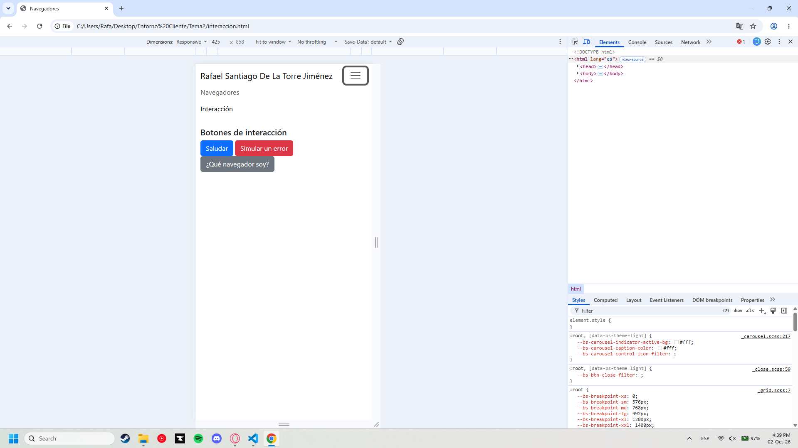
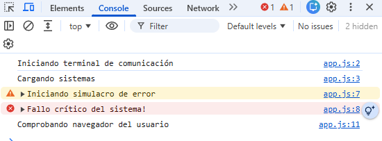
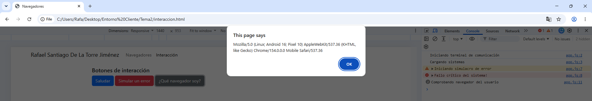
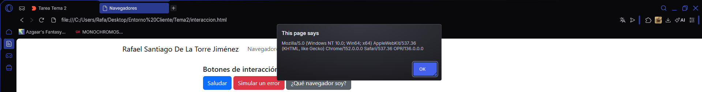
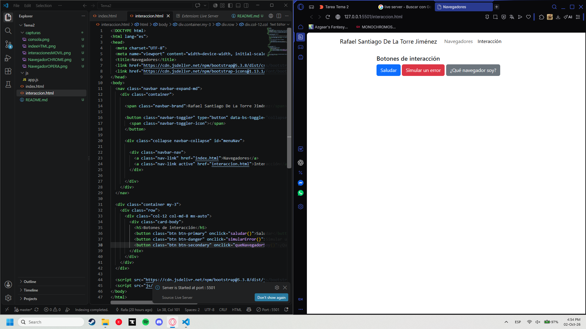

# Tarea 2: Navegadores y primera página interactiva
**Autor:** Rafael Santiago De La Torre Jiménez  
**Asignatura:** Desarrollo Web Entornos Cliente (DWEC)

---

## 1. Evidencias propias

A continuación se muestran las capturas de pantalla realizadas en mi equipo como evidencia del funcionamiento de la tarea.

**1. Página index.html en ordenador**  
  
*Se muestra la página principal en vista de escritorio. Es visible la barra de navegación con mi nombre completo y la tabla con los motores de los principales navegadores.*

**2. Página interaccion.html en modo dispositivo**  
  
*Vista de la página de interacción simulando un dispositivo móvil desde las herramientas de desarrollo (F12). El menú se colapsa correctamente en un botón hamburguesa y el contenido se adapta sin generar scroll horizontal.*

**3. Trazas en la consola del navegador**  
  
*Captura de la consola tras pulsar los tres botones en orden. Se aprecian las trazas de tipo `log`, `warn` y `error` generadas por el archivo externo `app.js`, sin mostrar errores de carga.*

**4. Alert del userAgent en dos navegadores distintos**  
  
  
*Se muestra el `alert()` con la cadena `navigator.userAgent` en Google Chrome y en Opera, permitiendo comparar las diferencias y similitudes en sus cadenas de texto.*

**5. Entorno de desarrollo**  
  
*Captura del entorno de trabajo con la carpeta `tema02` abierta en Visual Studio Code y la extensión Live Server ejecutándose en la barra de estado inferior.*

---

## 2. Quién hace qué: Análisis de un botón

A continuación se desglosa la responsabilidad de cada capa tecnológica tomando como ejemplo el botón **"Simular un error"**:

*   **HTML (Estructura):** La etiqueta `<button>` define el elemento interactivo en el DOM. El atributo `onclick="simularError()"` actúa como desencadenante, indicando al navegador qué función debe ejecutar cuando el usuario hace clic.
*   **Bootstrap / CSS (Presentación):** Las clases `btn` y `btn-danger` se encargan exclusivamente de la estética. Le otorgan al elemento el formato de botón, el color rojo de fondo, el texto blanco, los bordes redondeados y el efecto visual al pasar el ratón (*hover*). No intervienen en la lógica.
*   **JavaScript (Comportamiento):** La función `simularError()` definida en `js/app.js` contiene la lógica. Su única responsabilidad es interactuar con las herramientas del desarrollador, escribiendo mensajes en la consola mediante `console.warn()` y `console.error()`. No modifica el HTML ni muestra nada al usuario final.

---

## 3. Comparación de userAgent

Al comparar las cadenas `userAgent` obtenidas en Chrome y en Opera, se observa que ambos comparten la mayor parte del texto. Esto es lógico, ya que ambos navegadores están basados en el proyecto Chromium (utilizan los motores Blink y V8).

Sin embargo, en ambos aparecen palabras históricas como **Mozilla**, **AppleWebKit** o **Safari**, a pesar de no ser esos navegadores. Esto se debe a la compatibilidad hacia atrás (*legacy*). En los inicios de la web, los servidores comprobaban si el `userAgent` contenía "Mozilla" para enviar código avanzado; si no lo encontraba, servía una versión básica o bloqueaba el acceso. Cuando surgieron nuevos navegadores, se vieron obligados a incluir esas palabras en sus propias cadenas para "engañar" a los servidores y garantizar que las webs se cargaran correctamente. Hoy en día, esa parte de la cadena se mantiene por inercia, y lo que realmente identifica a cada navegador es el fragmento final (por ejemplo, `Chrome/XX.X` o `OPR/XX.X`).

---

## 4. Fuentes consultadas

*   **Can I use:** Para verificar la compatibilidad del selector CSS `:has()`.  
    Enlace: https://caniuse.com/css-has
*   **MDN Web Docs (Mozilla Developer Network):** Para la documentación técnica sobre el objeto `navigator` y la propiedad `userAgent`.  
    Enlace: https://developer.mozilla.org/es/docs/Web/API/Navigator/userAgent
*   **Documentación oficial de Bootstrap 5:** Para la sintaxis de los componentes `navbar`, `table` y `card`.  
    Enlace: https://getbootstrap.com/docs/5.3/getting-started/introduction/

---

## 5. Uso de IA

Para agilizar el proceso de aprendizaje de Bootstrap, le he pedido que me explicara las palabras clave para el diseño responsive, y para el navbar funcional. También he usado la IA para recordar JavaScript, y el README está hecho casi por completo por la IA. Todas las consultas fueron hechas con Qwen3.7-Plus, un modelo chino gratuito sin límite de archivos ni créditos, lo cual me ha permitido enviarle el pdf con las instrucciones para enviar código y asegurar que cumplía con todos los requisitos.